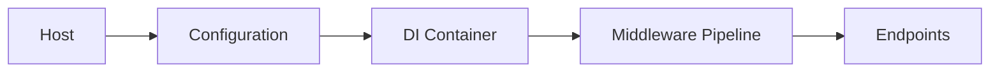
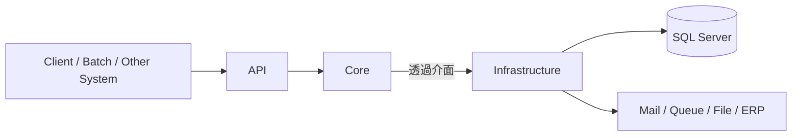
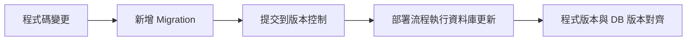
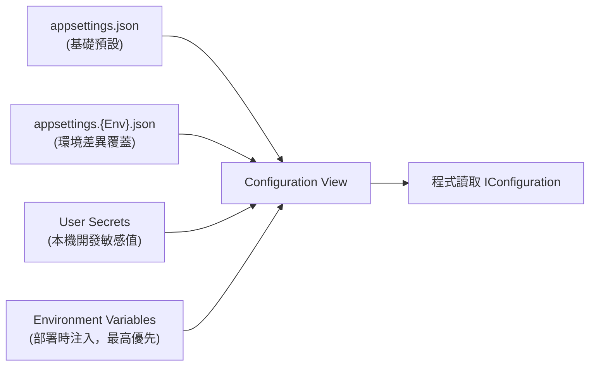
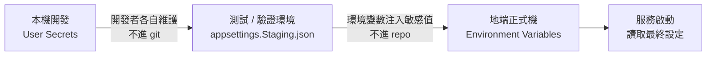
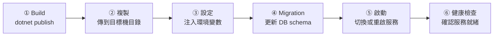

---
layout: cover
background: https://images.unsplash.com/photo-1516321318423-f06f85e504b3?auto=format&fit=crop&w=1600&q=80
class: text-white
---

<div
  class="eyebrow"
  v-motion
  :initial="{ opacity: 0, y: -40 }"
  :enter="{ opacity: 1, y: 0, transition: { duration: 700 } }"
>
  伺服器管控 · .NET 工程化 
</div>

<div
  v-motion
  :initial="{ opacity: 0, x: -80 }"
  :enter="{ opacity: 1, x: 0, transition: { duration: 900, delay: 120 } }"
>

# 用 .NET Core+ 建立可控的後端工程系統

</div>

<div
  class="hero-copy"
  v-motion
  :initial="{ opacity: 0, y: 24 }"
  :enter="{ opacity: 1, y: 0, transition: { duration: 800, delay: 260 } }"
>
  從 ASP.NET MVC / WebForms 的網站思維<br>
  切換到現代 ASP.NET Core 的後端工程思維
</div>

<div
  class="hero-meta"
  v-motion
  :initial="{ opacity: 0, y: 30 }"
  :enter="{ opacity: 1, y: 0, transition: { duration: 800, delay: 420 } }"
>
  企業內部 <span class="font-bold">API / Infrastructure / Core</span> 架構，地端自行部署
</div>

---
layout: two-cols-header
transition: slide-left
---

# 今天要回答的不是 API 細節，而是工程模型

::left::

<div
  class="panel panel--legacy"
  v-motion
  :initial="{ opacity: 0, x: -50 }"
  :enter="{ opacity: 1, x: 0 }"
>

<div class="col-badge col-badge--legacy">舊 ASP.NET 世界</div>

- `IIS` / `web.config` / `Global.asax` 是主舞台
- 網站專案常同時裝 UI、流程、資料存取、設定
- 關鍵流程常綁在人腦記憶與手動操作

</div>

::right::

<div
  class="panel panel--modern"
  v-motion
  :initial="{ opacity: 0, x: 50 }"
  :enter="{ opacity: 1, x: 0, transition: { delay: 160 } }"
>

<div class="col-badge col-badge--modern">現代 ASP.NET Core</div>

- Host、Middleware、DI、Configuration 可程式化
- API / Core / Infrastructure 可清楚分責
- 發佈、Migration、設定、部署都能進工程流程

</div>

---
layout: default
---

# 舊世界的主要痛點

<div class="panel small">

| 常見現象 | 真正的工程問題 |
| --- | --- |
| Controller 直接 new service / repository | 依賴隱藏，難測、難換 |
| SQL、商業規則、設定混在一起 | 修改牽一髮動全身 |
| DB 變更靠手動 SQL 或口頭通知 | 程式版與資料庫版脫鉤 |
| publish 後再改設定檔 | 環境不可重建，不可追蹤 |
| IIS 站台靠環境個別設定 | 部署知識綁在人，不綁在流程 |

</div>

<div class="mt-4 soft-grid three">
  <div class="panel metric-card" v-motion :initial="{ opacity: 0, y: 30 }" :enter="{ opacity: 1, y: 0 }"><div class="metric">高耦合</div><div class="small muted">改一處，處處連鎖</div></div>
  <div class="panel metric-card" v-motion :initial="{ opacity: 0, y: 30 }" :enter="{ opacity: 1, y: 0, transition: { delay: 120 } }"><div class="metric">低可測</div><div class="small muted">只能整站跑驗證</div></div>
  <div class="panel metric-card" v-motion :initial="{ opacity: 0, y: 30 }" :enter="{ opacity: 1, y: 0, transition: { delay: 240 } }"><div class="metric">低可控</div><div class="small muted">版本與環境不透明</div></div>
</div>

---
layout: statement
---

# 現代 .NET 想解的是工程控制點

<div
  class="statement-body"
  v-motion
  :initial="{ opacity: 0, scale: 0.92 }"
  :enter="{ opacity: 1, scale: 1, transition: { duration: 600 } }"
>
  把 <span class="accent">啟動、依賴、設定、資料庫版本、部署流程</span><br>
  變成可以被組裝、被測試、被追蹤的工程資產。
</div>

---
layout: section
transition: slide-up
---

# 序章

## 啟動架構

`Host` · `Middleware` · `DI` · `Configuration`

---
layout: two-cols-header
transition: slide-left
---

# 從網站思維轉成後端系統思維

::left::

<div class="panel" v-motion :initial="{ opacity: 0, x: -50 }" :enter="{ opacity: 1, x: 0 }">

### 舊 ASP.NET

- IIS 啟動網站
- `Global.asax` 接事件
- `web.config` 承擔大量設定
- 平台生命週期常像黑盒

</div>

::right::

<div class="panel" v-motion :initial="{ opacity: 0, x: 50 }" :enter="{ opacity: 1, x: 0, transition: { delay: 160 } }">

### ASP.NET Core

- `Program.cs` 明確建立 Host
- Configuration 分層載入設定
- DI 與 Middleware 在啟動時組裝
- 啟動流程是程式碼，不是背景魔法

</div>

---
layout: two-cols
---

# .NET Core 不是框架

::left::

<div class="platform-stack">

<div class="platform-layer platform-layer--tooling" v-click>
  <div class="layer-num">④</div>
  <div>
    <div class="layer-name">工具鏈 Tooling</div>
    <div class="layer-detail">dotnet CLI · NuGet · Build System</div>
  </div>
</div>

<div class="platform-layer platform-layer--framework" v-click>
  <div class="layer-num">③</div>
  <div>
    <div class="layer-name">Framework</div>
    <div class="layer-detail">ASP.NET Core · Worker Service · gRPC · Blazor</div>
  </div>
</div>

<div class="platform-layer platform-layer--bcl" v-click>
  <div class="layer-num">②</div>
  <div>
    <div class="layer-name">標準函式庫 BCL</div>
    <div class="layer-detail">IO · HTTP · JSON · Threading</div>
  </div>
</div>

<div class="platform-layer platform-layer--runtime" v-click>
  <div class="layer-num">①</div>
  <div>
    <div class="layer-name">Runtime — CLR</div>
    <div class="layer-detail">執行 C# · GC 記憶體管理 · JIT 編譯</div>
  </div>
</div>

</div>

::right::

<div class="panel small ml-2" v-click>

## 簡單來說

1. .NET 是`Platform`，不是單一框架
2. `ASP.NET Core` 只是其中**一種用途**
3. `Runtime` 只是最底層的**一層**

</div>

<div class="panel small mt-3  ml-2" v-click>

## vs .NET Framework

<div class="compare-row"><span class="muted">Host</span><span>IIS 唯一 → <span class="accent-green">可自行 Host</span></span></div>
<div class="compare-row"><span class="muted">平台</span><span>Windows 限定 → <span class="accent-green">跨平台</span></span></div>
<div class="compare-row"><span class="muted">架構</span><span>單一框架 → <span class="accent-green">模組化平台</span></span></div>

</div>

---
layout: default
---

# Host / Middleware / DI / Configuration 各自做什麼



<div class="mt-5 soft-grid four">

<div class="panel small" v-click>
<div class="layer-name mb-1">Host</div>
決定怎麼啟動、停止<br>掛 <code>logging</code>、執行環境
</div>

<div class="panel small" v-click>
<div class="layer-name mb-1">Configuration</div>
整合 JSON 檔案、<code>User Secrets</code><br>環境變數、命令列參數
</div>

<div class="panel small" v-click>
<div class="layer-name mb-1">DI Container</div>
宣告依賴關係<br>避免物件自行到處找東西
</div>

<div class="panel small" v-click>
<div class="layer-name mb-1">Middleware</div>
把 HTTP 流程拆成<br>可插拔的獨立段落
</div>

</div>

---
layout: two-cols-header
clicks: 3
---

# 最小範例：啟動流程長什麼樣

::left::

````md magic-move {at:2, lines: true}
```cs
var builder = WebApplication.CreateBuilder(args);

builder.Services.AddControllers();

var app = builder.Build();
app.MapControllers();
app.Run();
```
```cs
var builder = WebApplication.CreateBuilder(args);

builder.Services.AddControllers();
builder.Services.AddEndpointsApiExplorer();
builder.Services.AddSwaggerGen();

var app = builder.Build();
app.UseHttpsRedirection();
app.MapControllers();
app.Run();
```
<<< @/snippets/program.cs cs {*}{maxHeight:'400px'}
````

::right::

<div class="panel small" v-motion :initial="{ opacity: 0, x: 40 }" :enter="{ opacity: 1, x: 0 }">

<v-clicks>

- 第一段先看到最小可運作的 HTTP 入口
- 第二段補進 API 專案常見的開發配備
- 最後一步才把完整組裝與 middleware 串完整

</v-clicks>

</div>

---
layout: section
transition: slide-up
---

# 第二章

## 三層架構：API / Core / Infrastructure

責任分離 · 用例隔離 · 依賴反轉

---
layout: default
---

# API / Infrastructure / Core：三個常見的分層目的?



<div class="mt-4 soft-grid three">

<div class="panel small" v-click>
<div class="layer-name mb-1">API 層</div>
HTTP 入口、DTO、授權、Route 組裝<br>
<span class="muted">不碰商業邏輯，不直接存取資料庫</span>
</div>

<div class="panel small" v-click>
<div class="layer-name mb-1">Core 層</div>
用例、商業規則、流程、抽象介面定義<br>
<span class="muted">不依賴任何 Infrastructure 實作</span>
</div>

<div class="panel small" v-click>
<div class="layer-name mb-1">Infrastructure 層</div>
EF Core、外部服務、資料庫、設定實作<br>
<span class="muted">透過介面被 Core 呼叫，隨時可替換</span>
</div>

</div>

---
layout: two-cols-header
transition: slide-left
---

# 舊 vs 新：功能到底寫在哪裡

::left::

<div class="panel small" v-motion :initial="{ opacity: 0, x: -40 }" :enter="{ opacity: 1, x: 0 }">

### 舊做法

- Controller 直接寫流程
- Controller 直接碰 EF / SQL
- 寄信、檔案、設定都在同一層呼叫
- 需求一變，整條 HTTP 端一起改

</div>

::right::

<div class="panel small" v-motion :initial="{ opacity: 0, x: 40 }" :enter="{ opacity: 1, x: 0, transition: { delay: 160 } }">

### 新模型

- API 接住 HTTP 世界
- Core 定義用例與規則
- Infrastructure 提供技術細節
- 變的是實作，不是整個系統骨架

</div>

---
layout: default
clicks: 5
---

# 最小範例：DI 與用例註冊

````md magic-move {at:1, lines: true}
```cs {*|1-3} {style="font-size:0.85em"}
// Program.cs
// Core 介面 → Infrastructure 實作
builder.Services.AddScoped<IPermissionService, PermissionService>();
builder.Services.AddScoped<IJwtTokenService, JwtTokenService>();
builder.Services.AddScoped<IRefreshTokenRepository, RefreshTokenRepository>();
```
```cs {*|6-10} {style="font-size:0.85em"}
// Program.cs
builder.Services.AddScoped<IPermissionService, PermissionService>();
builder.Services.AddScoped<IJwtTokenService, JwtTokenService>();
builder.Services.AddScoped<IRefreshTokenRepository, RefreshTokenRepository>();

// 同一介面，啟動時決定走哪個實作
if (config.GetValue<bool>("Auth:UseDbAuth"))
    builder.Services.AddScoped<IAuthService, DbAuthService>();
else
    builder.Services.AddScoped<IAuthService, LdapAuthService>();
```
```cs {*|11-13} {style="font-size:0.85em"}
builder.Services.AddScoped<IPermissionService, PermissionService>();
builder.Services.AddScoped<IJwtTokenService, JwtTokenService>();
builder.Services.AddScoped<IRefreshTokenRepository, RefreshTokenRepository>();

if (config.GetValue<bool>("Auth:UseDbAuth"))
    builder.Services.AddScoped<IAuthService, DbAuthService>();
else
    builder.Services.AddScoped<IAuthService, LdapAuthService>();

// Repository + DbContext（Infrastructure 層）
builder.Services.AddScoped<IMemberRepository, MemberRepository>();
builder.Services.AddDbContext<SSOPortalDbContext>(opt =>
    opt.UseSqlServer(config.GetConnectionString("Default")));
```
````

<div
  v-motion
  :initial="{ opacity: 0, y: 12 }"
  :click-1="{ opacity: 1, y: 0, transition: { duration: 300 } }"
  :click-2="{ opacity: 0, y: -10, transition: { duration: 250 } }"
  style="position:absolute; bottom:52px; right:52px; pointer-events:none;"
  class="hint-bubble"
>
  每個 <code>介面 → 實作</code> 都在 DI 容器登記<br>
  Core 只知道介面，不依賴任何 Infrastructure<br>
  Runtime 才動態完成配對注入
</div>

<div
  v-motion
  :initial="{ opacity: 0, y: 12 }"
  :click-3="{ opacity: 1, y: 0, transition: { duration: 300 } }"
  :click-4="{ opacity: 0, y: -10, transition: { duration: 250 } }"
  style="position:absolute; bottom:52px; right:52px; pointer-events:none;"
  class="hint-bubble"
>
  同一個 <code>IAuthService</code> 介面，兩種實作<br>
  設定檔的 <code>Auth:UseDbAuth</code> 決定走哪個<br>
  所有呼叫端（Controller / Service）完全不需要修改
</div>

<div
  v-motion
  :initial="{ opacity: 0, y: 12 }"
  :click-5="{ opacity: 1, y: 0, transition: { duration: 300 } }"
  style="position:absolute; bottom:52px; right:52px; pointer-events:none;"
  class="hint-bubble"
>
  Repository 與 DbContext 一樣透過 DI 注入<br>
  不在 Controller / Service 手動 <code>new</code><br>
  連線字串從設定層讀入，不寫死在程式碼裡
</div>

<style>
.hint-bubble {
  background: rgba(56, 189, 248, 0.10);
  border: 1px solid rgba(56, 189, 248, 0.40);
  border-radius: 10px;
  padding: 10px 20px;
  font-size: 0.82em;
  line-height: 1.7;
  color: #7dd3fc;
  backdrop-filter: blur(6px);
  max-width: 300px;
  text-align: center;
}
</style>

---
layout: section
transition: slide-up
---

# 第三章

## 資料庫版本治理

EF Core · Migration · DbContext

---
layout: default
transition: slide-left
---

# ORM / EF Core 先解的是哪些舊痛點

<div class="soft-grid two">

<div class="panel small panel--legacy">
<div class="col-badge col-badge--legacy">傳統 ADO.NET / SQL</div>

- mapping 樣板碼很多
- connection / transaction 管理零散
- 查詢散在各層，重用差
- schema 改了，程式不一定同步，還得透過
  <p v-mark.red >人工控管腳本確定不同環境的同步狀態</p>
</div>

<div v-click   
  v-motion
  :initial="{ opacity: 0, y: 12 }"
  :enter="{ opacity: 1, y: 0, transition: { duration: 300 } }"
 class="panel small panel--modern">
<div class="col-badge col-badge--modern">EF Core 的改善</div>

- `DbContext` 集中資料存取 <span class="muted">— 不再散落在各層，一個入口統一管</span>
- query 與模型可以工程化管理 <span class="muted">— LINQ 寫法、型別安全，不怕 SQL 字串拼錯</span>
- migration 可描述 schema 版本 <span class="muted">— 欄位怎麼長大都有記錄，新機器執行一行就追上</span>
- 交易、攔截器、追蹤策略比較可控 <span class="muted">— 不用手寫 `BEGIN TRAN`，DbContext 直接包住</span>
</div>

</div>

<div
  v-click
  v-motion
  :initial="{ opacity: 0, y: 16 }"
  :enter="{ opacity: 1, y: 0, transition: { duration: 400 } }"
  class="panel mt-4"
  style="border-color: rgba(139,92,246,0.5); background: rgba(139,92,246,0.08);"
>
  <span style="color:#a78bfa; font-weight:600;">TL;DR：</span>
  ORM 的出現不只是「少寫 SQL」，而是把不同環境之間的溝通與管理問題<strong v-mark.red="4">程式碼化</strong>。
  Schema 怎麼演進、交易邊界在哪、查詢邏輯長什麼樣——這些過去靠人工協調的事，
  現在全部由程式碼描述、版本控制追蹤，<strong v-mark.red="4">控制權完全交回開發者手中</strong>。
</div>

---
layout: default
clicks: 5
---

# EF Core 請求流程：從 DI 到資料庫

````md magic-move {at:1, lines: true}
```cs {*|2-4} {style="font-size:0.85em"}
// ① Program.cs — DI 登記
builder.Services.AddScoped<IMemberRepository, MemberRepository>();
builder.Services.AddDbContext<SSOPortalDbContext>(opt =>
    opt.UseSqlServer(config.GetConnectionString("Default")));
```
```cs {*|2,7-8} {style="font-size:0.85em"}
// ② API 層 — 建構子注入，只認識介面
public class MemberController(IMemberRepository repo) : ControllerBase
{
    [HttpGet("{memNo:guid}")]
    public async Task<IActionResult> GetMember(Guid memNo)
    {
        var member = await repo.GetByIdAsync(memNo);
        return member is null ? NotFound() : Ok(member);
    }
}
```
```cs {*|4-12} {style="font-size:0.85em"}
// ③ Infrastructure 層 — LINQ 實作，DbContext 才在這裡出現
public class MemberRepository(SSOPortalDbContext db) : IMemberRepository
{
    public async Task<MemberDto?> GetByIdAsync(Guid memNo)
        => await db.MemMembers
            .Where(m => m.MemNo == memNo && m.MemStatus == 1)
            .Select(m => new MemberDto
            {
                MemNo   = m.MemNo,
                Account = m.MemAccount,
                Name    = m.MemName,
            })
            .FirstOrDefaultAsync();
}
```
````

<div
  v-motion
  :initial="{ opacity: 0, y: 12 }"
  :click-1="{ opacity: 1, y: 0, transition: { duration: 300 } }"
  :click-2="{ opacity: 0, y: -10, transition: { duration: 250 } }"
  style="position:absolute; bottom:52px; right:52px; pointer-events:none;"
  class="hint-bubble"
>
  Interface → Implementation 綁進容器<br>
  Controller 永遠不會直接 <code>new</code> Repository<br>
  DbContext 連線字串從設定層讀入
</div>

<div
  v-motion
  :initial="{ opacity: 0, y: 12 }"
  :click-3="{ opacity: 1, y: 0, transition: { duration: 300 } }"
  :click-4="{ opacity: 0, y: -10, transition: { duration: 250 } }"
  style="position:absolute; bottom:52px; right:52px; pointer-events:none;"
  class="hint-bubble"
>
  建構子只宣告 <code>IMemberRepository</code><br>
  完全不知道 EF Core / DbContext 的存在<br>
  API 層與資料層完全解耦
</div>

<div
  v-motion
  :initial="{ opacity: 0, y: 12 }"
  :click-5="{ opacity: 1, y: 0, transition: { duration: 300 } }"
  style="position:absolute; bottom:52px; right:52px; pointer-events:none;"
  class="hint-bubble"
>
  LINQ 取代 SQL 字串拼接，型別安全<br>
  <code>.Where()</code> / <code>.Select()</code> 在編譯期就能抓錯<br>
  DbContext 只在 Infrastructure 這一層出現
</div>

---
layout: statement
---

# Migration 不是「建表工具」

<div
  class="statement-body"
  v-motion
  :initial="{ opacity: 0, scale: 0.92 }"
  :enter="{ opacity: 1, scale: 1, transition: { duration: 600 } }"
>
  而是把 <span class="accent">「資料庫要長成什麼樣」</span> 這件事<br>
  寫進程式碼、進版本控制、進部署流程。
</div>

<div
  class="hero-copy"
  v-motion
  :initial="{ opacity: 0, y: 20 }"
  :enter="{ opacity: 1, y: 0, transition: { duration: 700, delay: 900 } }"
>
  從「靠人記得執行 SQL」<br>

 到「程式自己知道資料庫現在在哪個版本」。

</div>

---
layout: default
---

# What is 版本治理工具?



<div class="mt-4 soft-grid four">

<div class="panel small" v-click>
<div class="layer-name mb-1">可追蹤</div>
DB 變更有歷史，知道誰改了什麼
</div>

<div class="panel small" v-click>
<div class="layer-name mb-1">可重建</div>
新環境直接執行 migration，不靠手工腳本
</div>

<div class="panel small" v-click>
<div class="layer-name mb-1">可比對</div>
程式版本與 DB schema 版本對齊，差異一目了然
</div>

<div class="panel small" v-click>
<div class="layer-name mb-1">可驗證</div>
部署流程能確認程式對應正確的 schema 版本
</div>

</div>

---
layout: default
clicks: 7
---

# 最小範例：DbContext 與 Migration 指令
#### 假設我們要新增一張 Member Table

````md magic-move {at:1, lines: true}
```cs {*|2-8} {style="font-size:0.85em"}
// Project.Core
// ① 先修改 Model — EF Core 追蹤的 schema 定義
public class Member
{
    public Guid   MemNo      { get; set; }
    public string MemAccount { get; set; } = string.Empty;
    public string MemName    { get; set; } = string.Empty;
    public string MemStatus  { get; set; } = "1";
}
```
```cs {*|5} {style="font-size:0.85em"}
// ② DbContext 加入 DbSet，EF Core 才開始追蹤這張表
public sealed class SSOPortalDbContext(
    DbContextOptions<SSOPortalDbContext> options) : DbContext(options)
{
    public DbSet<Member> Members => Set<Member>();
    // 其他 DbSet...
}
```
```powershell {*|2-4} {style="font-size:0.85em"}
# ③ EF Core 比對 Model 與現有 schema，自動產生 migration 檔案
dotnet ef migrations add AddMemberTable `
  --project src/SSOPortal.Infrastructure `
  --startup-project src/SSOPortal.Api
```
```powershell {*|2,5} {style="font-size:0.85em"}
# ④ 套用 migration，將 schema 變更寫入資料庫
dotnet ef database update

# 或在程式啟動時自動執行（適合地端部署流程）
await context.Database.MigrateAsync();
```
````

<div
  v-motion
  :initial="{ opacity: 0, y: 12 }"
  :click-1="{ opacity: 1, y: 0, transition: { duration: 300 } }"
  :click-2="{ opacity: 0, y: -10, transition: { duration: 250 } }"
  style="position:absolute; bottom:52px; right:52px; pointer-events:none;"
  class="hint-bubble"
>
  <strong class="text-orange-400">IMPORTANT</strong><br>
  先改 <code>Core.Model</code>，EF Core 才有辦法<br>
  偵測到 schema 與程式碼之間的差異
</div>

<div
  v-motion
  :initial="{ opacity: 0, y: 12 }"
  :click-3="{ opacity: 1, y: 0, transition: { duration: 300 } }"
  :click-4="{ opacity: 0, y: -10, transition: { duration: 250 } }"
  style="position:absolute; bottom:52px; right:52px; pointer-events:none;"
  class="hint-bubble"
>
  <code>DbSet&lt;Member&gt;</code> 告訴 EF Core<br>
  「這個 class 對應到一張資料表」<br>
  沒有 DbSet，migrations add 不會產生任何東西
</div>

<div
  v-motion
  :initial="{ opacity: 0, y: 12 }"
  :click-5="{ opacity: 1, y: 0, transition: { duration: 300 } }"
  :click-6="{ opacity: 0, y: -10, transition: { duration: 250 } }"
  style="position:absolute; bottom:52px; right:52px; pointer-events:none;"
  class="hint-bubble"
>
  Migration 檔案產生後要 <strong>commit 進版控</strong><br>
  這個檔案就是 schema 的變更歷史<br>
  <code>--project</code> 指定 Infrastructure 層放置
</div>

<div
  v-motion
  :initial="{ opacity: 0, x: -16 }"
  :click-4="{ opacity: 1, x: 0, transition: { duration: 350 } }"
  :click-6="{ opacity: 0, x: -16, transition: { duration: 250 } }"
  style="position:absolute; bottom:52px; left:52px; pointer-events:none; font-family:monospace; font-size:0.78em; line-height:1.8; color:#86efac; background:rgba(34,197,94,0.08); border:1px solid rgba(34,197,94,0.35); border-radius:10px; padding:10px 18px;"
>
  <div style="color:#4ade80; margin-bottom:4px;">📁 產生的檔案</div>
  <div>src/SSOPortal.Infrastructure/</div>
  <div>└── Migrations/</div>
  <div>&nbsp;&nbsp;&nbsp;&nbsp;├── <span style="color:#fde68a;">20260506_AddMemberTable.cs</span></div>
  <div>&nbsp;&nbsp;&nbsp;&nbsp;│&nbsp;&nbsp; <span style="color:#94a3b8; font-size:0.9em;">← Up() / Down() 變更邏輯</span></div>
  <div>&nbsp;&nbsp;&nbsp;&nbsp;├── <span style="color:#fde68a;">20260506_AddMemberTable.Designer.cs</span></div>
  <div>&nbsp;&nbsp;&nbsp;&nbsp;│&nbsp;&nbsp; <span style="color:#94a3b8; font-size:0.9em;">← EF Core 快照，勿手改</span></div>
  <div>&nbsp;&nbsp;&nbsp;&nbsp;└── <span style="color:#fde68a;">SSOPortalDbContextModelSnapshot.cs</span></div>
  <div>&nbsp;&nbsp;&nbsp;&nbsp;&nbsp;&nbsp;&nbsp; <span style="color:#94a3b8; font-size:0.9em;">← 最新 schema 狀態</span></div>
</div>

<div
  v-motion
  :initial="{ opacity: 0, y: 12 }"
  :click-7="{ opacity: 1, y: 0, transition: { duration: 300 } }"
  style="position:absolute; bottom:52px; right:52px; pointer-events:none;"
  class="hint-bubble"
>
  <code>database update</code> 在開發時手動執行<br>
  <code>MigrateAsync()</code> 讓部署流程自動對齊 schema<br>
  兩者選其一，不需要雙管齊下
</div>

<style>
.hint-bubble {
  background: rgba(56, 189, 248, 0.10);
  border: 1px solid rgba(56, 189, 248, 0.40);
  border-radius: 10px;
  padding: 10px 20px;
  font-size: 0.82em;
  line-height: 1.7;
  color: #7dd3fc;
  backdrop-filter: blur(6px);
  max-width: 300px;
  text-align: center;
}
</style>

---
layout: section
transition: slide-up
---

# 第四章

## 設定治理

Configuration · Secrets · Environment Variables

---
layout: default
---

# 設定治理：設定不是值而已，是系統邊界



<div class="mt-3 soft-grid four">

<div class="panel small" v-click>
  <div class="layer-name mb-1">appsettings.json</div>
  非敏感預設值，<strong>可進 repo</strong><br>
  <span class="muted">所有環境共用的基礎起點</span>
</div>

<div class="panel small" v-click>
  <div class="layer-name mb-1">appsettings.{Env}.json</div>
  覆蓋特定環境差異，<strong>可進 repo</strong><br>
  <span class="muted">Dev / Staging / Prod 各自獨立</span>
</div>

<div class="panel small" v-click>
  <div class="layer-name mb-1">User Secrets</div>
  本機開發用，<strong>不進 repo</strong><br>
  <span class="muted">存在使用者目錄，每人自己維護</span>
</div>

<div class="panel small" v-click>
  <div class="layer-name mb-1">Environment Variables</div>
  部署時注入，<strong>優先權最高</strong><br>
  <span class="muted">覆蓋所有下層設定，適合正式機敏感值</span>
</div>

</div>

---
layout: default
clicks: 5
---

# 最小範例：*appsettings* 怎麼長大

````md magic-move {at:1, lines: true}
```json {*|2-4} {style="font-size:0.85em"}
{
  "ConnectionStrings": {
    "Default": "Server=.;Database=SSOPortal;Trusted_Connection=True"
  }
}
```
```json {*|5-11} {style="font-size:0.85em"}
{
  "ConnectionStrings": {
    "Default": "Server=.;Database=SSOPortal;Trusted_Connection=True"
  },
  "Auth": {
    "UseDbAuth": true,
    "JwtExpiryMinutes": 60
  },
  "Mail": {
    "Host": "smtp.internal.local",
    "Port": 25
  }
}
```
```json {*|8,13} {style="font-size:0.85em"}
{
  "ConnectionStrings": {
    "Default": "Server=.;Database=SSOPortal;Trusted_Connection=True"
  },
  "Auth": {
    "UseDbAuth": true,
    "JwtExpiryMinutes": 60,
    "JwtSecret": "← 由環境變數注入，不放在這裡"
  },
  "Mail": {
    "Host": "smtp.internal.local",
    "Port": 25,
    "SmtpPassword": "← 同上，敏感值不進 repo"
  }
}
```
````

<div
  v-motion
  :initial="{ opacity: 0, y: 12 }"
  :click-1="{ opacity: 1, y: 0, transition: { duration: 300 } }"
  :click-2="{ opacity: 0, y: -10, transition: { duration: 250 } }"
  style="position:absolute; bottom:52px; right:52px; pointer-events:none;"
  class="hint-bubble"
>
  先放非敏感的基礎設定<br>
  連線字串的 Server / Database 名稱可進 repo<br>
  <strong>密碼與帳號留給外部注入</strong>
</div>

<div
  v-motion
  :initial="{ opacity: 0, y: 12 }"
  :click-3="{ opacity: 1, y: 0, transition: { duration: 300 } }"
  :click-4="{ opacity: 0, y: -10, transition: { duration: 250 } }"
  style="position:absolute; bottom:52px; right:52px; pointer-events:none;"
  class="hint-bubble"
>
  模組化擴充：每個功能區塊一個 section<br>
  <code>Auth.UseDbAuth</code>、<code>Mail.Host</code> 等非敏感值<br>
  可安全放進 repo 讓所有人共用
</div>

<div
  v-motion
  :initial="{ opacity: 0, y: 12 }"
  :click-5="{ opacity: 1, y: 0, transition: { duration: 300 } }"
  style="position:absolute; bottom:52px; right:52px; pointer-events:none;"
  class="hint-bubble"
>
  <strong>敏感值就算有預設也不該寫在這裡</strong><br>
  用佔位文字當提示，強迫外部注入<br>
  <code>appsettings.json</code> 應隨時可以安全公開
</div>

<style>
.hint-bubble {
  background: rgba(56, 248, 191, 0.1);
  border: 1px solid rgba(56, 248, 203, 0.4);
  border-radius: 10px;
  padding: 10px 20px;
  font-size: 0.82em;
  line-height: 1.7;
  color: #7dd3fc;
  backdrop-filter: blur(6px);
  max-width: 300px;
  text-align: center;
}
</style>

---
layout: default
---

# 哪些值該放檔案，哪些不該

<div class="soft-grid two">

<div class="panel panel--modern" v-motion :initial="{ opacity: 0, x: -40 }" :enter="{ opacity: 1, x: 0 }">
<div class="col-badge col-badge--modern">✅ 可以進 repo</div>

- 連線的 Server、Port、Database 名稱
- `Auth.UseDbAuth`、`Auth.JwtExpiryMinutes` 等行為旗標
- Logging level、Timeout、批次大小等運行參數
- Feature flags 預設狀態
- 郵件伺服器 Host（不含帳密）

</div>

<div class="panel panel--legacy" v-motion :initial="{ opacity: 0, x: 40 }" :enter="{ opacity: 1, x: 0, transition: { delay: 160 } }">
<div class="col-badge col-badge--legacy">❌ 不該進 repo</div>

- 資料庫密碼、連線帳號
- JWT Secret、API Key、Token
- SMTP 帳密、LDAP bind 密碼
- 憑證與私鑰（`.pfx`、`.pem`）
- 任何長期固定的高權限共用帳密

</div>

</div>

<div
  v-click
  v-motion
  :initial="{ opacity: 0, y: 16 }"
  :enter="{ opacity: 1, y: 0, transition: { duration: 400 } }"
  class="panel mt-4"
  style="border-color: rgba(245,158,11,0.5); background: rgba(245,158,11,0.08);"
>
  <span style="color:#fbbf24; font-weight:600;">判斷原則：</span>
  把這個檔案放上 GitHub public repo，你會不會緊張？<br>
  會的話就不該進 repo，改用 User Secrets（本機）或 Environment Variables（部署）注入。
</div>

<style>
.hint-bubble {
  background: rgba(56, 248, 191, 0.1);
  border: 1px solid rgba(56, 248, 203, 0.4);
  border-radius: 10px;
  padding: 10px 20px;
  font-size: 0.82em;
  line-height: 1.7;
  color: #7dd3fc;
  backdrop-filter: blur(6px);
  max-width: 300px;
  text-align: center;
}
</style>

---
layout: default
clicks: 5
---

# 最小範例：環境變數如何覆寫設定

````md magic-move {at:1, lines: true}
```powershell {*|2} {style="font-size:0.85em"}
# ① 告訴 ASP.NET Core 現在是哪個環境
$env:ASPNETCORE_ENVIRONMENT = "Production"
```
```powershell {*|4-5} {style="font-size:0.85em"}
$env:ASPNETCORE_ENVIRONMENT = "Production"

# ② __ 雙底線對應 JSON 巢狀層，直接覆蓋 appsettings.json 的值
$env:ConnectionStrings__Default = `
  "Server=sql-prod;Database=SSOPortal;User Id=svc_api;Password=***"
```
```powershell {*|7-8} {style="font-size:0.85em"}
$env:ASPNETCORE_ENVIRONMENT = "Production"
$env:ConnectionStrings__Default = `
  "Server=sql-prod;Database=SSOPortal;User Id=svc_api;Password=***"

# ③ 多個敏感設定各自一個環境變數，由部署工具統一注入
$env:Auth__JwtSecret    = "prod-secret-from-deployment-vault"
$env:Mail__SmtpPassword = "smtp-prod-password"
```
````

<div
  v-motion
  :initial="{ opacity: 0, y: 12 }"
  :click-1="{ opacity: 1, y: 0, transition: { duration: 300 } }"
  :click-2="{ opacity: 0, y: -10, transition: { duration: 250 } }"
  style="position:absolute; bottom:52px; right:52px; pointer-events:none;"
  class="hint-bubble"
>
  <code>ASPNETCORE_ENVIRONMENT</code> 決定讀哪個覆蓋層<br>
  <code>appsettings.Production.json</code> 自動載入<br>
  不設定時預設為 <code>Production</code>
</div>

<div
  v-motion
  :initial="{ opacity: 0, y: 12 }"
  :click-3="{ opacity: 1, y: 0, transition: { duration: 300 } }"
  :click-4="{ opacity: 0, y: -10, transition: { duration: 250 } }"
  style="position:absolute; bottom:52px; right:52px; pointer-events:none;"
  class="hint-bubble"
>
  <strong><code>__</code> 雙底線</strong> 對應 JSON 巢狀<br>
  <code>ConnectionStrings__Default</code><br>
  等同 JSON 裡的 <code>ConnectionStrings.Default</code><br>
  程式用 <code>config.GetConnectionString("Default")</code> 讀取
</div>

<div
  v-motion
  :initial="{ opacity: 0, y: 12 }"
  :click-5="{ opacity: 1, y: 0, transition: { duration: 300 } }"
  style="position:absolute; bottom:52px; right:52px; pointer-events:none;"
  class="hint-bubble"
>
  每個敏感值各自一個環境變數<br>
  部署工具（Ansible、BAT、CI/CD）統一注入<br>
  <strong>publish 包永遠不含正式環境祕密</strong>
</div>

---
layout: default
---

# 從開發到地端部署：設定鏈路要打通



<div class="mt-4 soft-grid three">

<div class="panel small" v-click>
  <div class="layer-name mb-1">本機開發</div>
  <code>dotnet user-secrets set "Auth:JwtSecret" "dev-only"</code><br>
  <span class="muted">存在 <code>%APPDATA%\Microsoft\UserSecrets</code>，永不進 git</span>
</div>

<div class="panel small" v-click>
  <div class="layer-name mb-1">測試 / 驗證環境</div>
  <code>appsettings.Staging.json</code> 覆蓋 Host、Port<br>
  <span class="muted">敏感值仍由環境變數注入，不進 repo</span>
</div>

<div class="panel small" v-click>
  <div class="layer-name mb-1">地端正式機</div>
  所有敏感值由部署工具寫入 Windows 環境變數<br>
  <span class="muted">最小暴露、分環境隔離、隨時可輪替</span>
</div>

</div>

<div
  v-click
  v-motion
  :initial="{ opacity: 0, y: 16 }"
  :enter="{ opacity: 1, y: 0, transition: { duration: 400 } }"
  class="panel mt-3"
  style="border-color: rgba(56,189,248,0.5); background: rgba(56,189,248,0.08);"
>
  <span style="color:#38bdf8; font-weight:600;">核心概念：</span>
  同一個 publish 包，靠注入不同環境變數，就能在開發、測試、正式三個環境正確啟動。
  程式碼本身不知道、也不需要知道「現在在哪個環境跑」。
</div>

---
layout: statement
---

# 真正危險的不是「有沒有用環境變數」

<div
  class="statement-body danger-body"
  v-motion
  :initial="{ opacity: 0, scale: 0.9 }"
  :enter="{ opacity: 1, scale: 1, transition: { duration: 600 } }"
>
  而是裡面裝了什麼、誰能看、誰能改、怎麼輪替。<br>
  現代化不是把密碼從檔案搬家，而是建立治理方式。
</div>

---
layout: section
transition: slide-up
---

# 第五章

## 地端自部署

標準化流程 · 產物解耦 · 可重複執行

---
layout: default
transition: slide-left
---

# 地端自部署也可以很現代

<div class="soft-grid two">

<div class="panel panel--legacy" v-motion :initial="{ opacity: 0, x: -40 }" :enter="{ opacity: 1, x: 0 }">
<div class="col-badge col-badge--legacy">手動 IIS 點選式部署</div>

- 站台設定散落在 IIS 管理視窗，<strong>不在版控裡</strong>
- 同一專案在不同機器，步驟可能都不同
- 發生故障時無法比對各台機器的設定差異
- 部署知識靠人記、靠口傳，人走了知識就不見
- 沒有標準，每次部署都是一次賭注

</div>

<div class="panel panel--modern" v-motion :initial="{ opacity: 0, x: 40 }" :enter="{ opacity: 1, x: 0, transition: { delay: 160 } }">
<div class="col-badge col-badge--modern">標準化部署模型</div>

- 產物固定（publish artifact），與環境完全解耦
- 設定外部化：敏感值在目標機注入，不進 artifact
- DB 更新是流程中的<strong>顯性步驟</strong>，不能隱藏跳過
- 啟動參數寫在腳本裡，不靠人記憶
- 可重複執行、可追蹤版本、可交接給任何人

</div>

</div>

<div
  v-click
  v-motion
  :initial="{ opacity: 0, y: 16 }"
  :enter="{ opacity: 1, y: 0, transition: { duration: 400 } }"
  class="panel mt-4"
  style="border-color: rgba(245,158,11,0.5); background: rgba(245,158,11,0.08);"
>
  <span style="color:#fbbf24; font-weight:600;">關鍵：</span>
  不是要換什麼工具，而是把「部署是哪些步驟」這件事<strong>寫進腳本、寫進流程</strong>。
  就算只是 PowerShell + 目錄慣例，只要標準化就能可控、可交接。
</div>

---
layout: default
---

# 地端自部署的基本流程



<div class="mt-4 soft-grid three">

<div class="panel small" v-click>
  <div class="layer-name mb-1">① – ②　Build & 複製</div>
  <code>dotnet publish -c Release -o ./publish</code><br>
  <span class="muted">產物與環境無關，同一包可部署到任何機器</span>
</div>

<div class="panel small" v-click>
  <div class="layer-name mb-1">③ – ④　設定 & Migration</div>
  環境變數注入後執行 <code>MigrateAsync()</code><br>
  <span class="muted">DB schema 對齊必須是流程中的明確步驟</span>
</div>

<div class="panel small" v-click>
  <div class="layer-name mb-1">⑤ – ⑥　啟動 & 健康檢查</div>
  <code>Start-Service</code> 後打 <code>/healthz</code> 確認<br>
  <span class="muted">不靠人目視，腳本自動判斷是否部署成功</span>
</div>

</div>

---
layout: default
clicks: 5
---

# 最小範例：部署腳本與外部化設定

````md magic-move {at:1, lines: true}
```powershell {*|2-3} {style="font-size:0.85em"}
# ① 腳本入口：參數化路徑與服務名稱
param(
    [string]$ArtifactPath = "D:\deploy\ssoportal-api",
    [string]$ServiceName  = "SSOPortalApi"
)
```
```powershell {*|7-9} {style="font-size:0.85em"}
param(
    [string]$ArtifactPath = "D:\deploy\ssoportal-api",
    [string]$ServiceName  = "SSOPortalApi"
)

# ② 注入環境設定，不寫死在腳本裡
$env:ASPNETCORE_ENVIRONMENT     = "Production"
$env:ConnectionStrings__Default = $env:DB_CONN     # 由外部傳入
$env:Auth__JwtSecret            = $env:JWT_SECRET
```
```powershell {*|12-16} {style="font-size:0.85em"}
param(
    [string]$ArtifactPath = "D:\deploy\ssoportal-api",
    [string]$ServiceName  = "SSOPortalApi"
)
$env:ASPNETCORE_ENVIRONMENT     = "Production"
$env:ConnectionStrings__Default = $env:DB_CONN
$env:Auth__JwtSecret            = $env:JWT_SECRET

# ③ 完整部署流程：停止 → 複製 → 對齊 DB → 啟動 → 確認
Stop-Service $ServiceName -ErrorAction SilentlyContinue
Copy-Item "$ArtifactPath\*" "D:\services\ssoportal-api\" -Recurse -Force
dotnet ef database update --project SSOPortal.Infrastructure
Start-Service $ServiceName
Invoke-RestMethod "http://localhost:5000/healthz"
Write-Host "✅ 部署完成"
```
````

<div
  v-motion
  :initial="{ opacity: 0, y: 12 }"
  :click-1="{ opacity: 1, y: 0, transition: { duration: 300 } }"
  :click-2="{ opacity: 0, y: -10, transition: { duration: 250 } }"
  style="position:absolute; bottom:52px; right:52px; pointer-events:none;"
  class="hint-bubble"
>
  路徑與服務名稱參數化<br>
  同一個腳本可以部署到任何目標機<br>
  <strong>不寫死、不靠人記</strong>
</div>

<div
  v-motion
  :initial="{ opacity: 0, y: 12 }"
  :click-3="{ opacity: 1, y: 0, transition: { duration: 300 } }"
  :click-4="{ opacity: 0, y: -10, transition: { duration: 250 } }"
  style="position:absolute; bottom:52px; right:52px; pointer-events:none;"
  class="hint-bubble"
>
  <code>$env:DB_CONN</code> 由呼叫者（CI/CD 或人工）傳入<br>
  腳本本身不含任何正式環境祕密<br>
  <strong>artifact + 腳本都可以進版控</strong>
</div>

<div
  v-motion
  :initial="{ opacity: 0, y: 12 }"
  :click-5="{ opacity: 1, y: 0, transition: { duration: 300 } }"
  style="position:absolute; bottom:52px; right:52px; pointer-events:none;"
  class="hint-bubble"
>
  五個步驟全部在腳本裡，順序固定<br>
  Migration 是顯性步驟，不能跳過<br>
  <strong>健康檢查確認後才算部署成功</strong>
</div>

---
layout: default
---

# 新專案一開始就該建立的工程基線

<div class="soft-grid two">

<div class="panel" v-motion :initial="{ opacity: 0, x: -40 }" :enter="{ opacity: 1, x: 0 }">

### 專案骨架

- `API / Core / Infrastructure` 三層分責，邊界從第一天就清楚
- `Program.cs` 統一組裝，依賴關係一目了然
- Options Pattern 綁定設定，型別安全、不手動讀字串
- 統一 logging、全域例外處理、`/healthz` health checks

</div>

<div class="panel" v-motion :initial="{ opacity: 0, x: 40 }" :enter="{ opacity: 1, x: 0, transition: { delay: 160 } }">

### 工程流程

- Migration 進版控，DB 變更有歷史可查
- 本機敏感值用 User Secrets，不進 repo
- publish 產物與環境設定完全分離
- 至少有 `build.ps1`、`deploy.ps1` 基本腳本
- README 寫清楚啟動步驟與部署方式

</div>

</div>

<div
  v-click
  v-motion
  :initial="{ opacity: 0, y: 16 }"
  :enter="{ opacity: 1, y: 0, transition: { duration: 400 } }"
  class="panel mt-4"
  style="border-color: rgba(56,189,248,0.5); background: rgba(56,189,248,0.08);"
>
  <span style="color:#38bdf8; font-weight:600;">核心心態：</span>
  從「能跑就好」到「可控、可重建、可交接」——這不是大工程，是從第一個 commit 就養成的習慣。
</div>

---
layout: default
---

# 今天要帶走的核心訊息

<div class="panel">

<div class="soft-grid five" style="--cols:1; gap: 0.6rem;">

<div v-click style="display:flex; align-items:baseline; gap:0.8rem; padding: 0.5rem 0; border-bottom: 1px solid rgba(255,255,255,0.07);">
  <span style="color:#38bdf8; font-weight:700; font-size:1.2em; min-width:1.4rem;">1</span>
  <span>現代 .NET 的價值在 <strong>工程控制點</strong>，不是語法糖</span>
</div>
<div v-click style="display:flex; align-items:baseline; gap:0.8rem; padding: 0.5rem 0; border-bottom: 1px solid rgba(255,255,255,0.07);">
  <span style="color:#38bdf8; font-weight:700; font-size:1.2em; min-width:1.4rem;">2</span>
  <span><code>API / Core / Infrastructure</code> 是 <strong>責任分離</strong>，讓每一層只做自己該做的事</span>
</div>
<div v-click style="display:flex; align-items:baseline; gap:0.8rem; padding: 0.5rem 0; border-bottom: 1px solid rgba(255,255,255,0.07);">
  <span style="color:#38bdf8; font-weight:700; font-size:1.2em; min-width:1.4rem;">3</span>
  <span>EF Core + Migration 是 <strong>資料庫版本治理</strong>，把 schema 演進納入版控</span>
</div>
<div v-click style="display:flex; align-items:baseline; gap:0.8rem; padding: 0.5rem 0; border-bottom: 1px solid rgba(255,255,255,0.07);">
  <span style="color:#38bdf8; font-weight:700; font-size:1.2em; min-width:1.4rem;">4</span>
  <span>設定與祕密治理是 <strong>系統邊界的一部分</strong>，不是部署後才想的事</span>
</div>
<div v-click style="display:flex; align-items:baseline; gap:0.8rem; padding: 0.5rem 0;">
  <span style="color:#38bdf8; font-weight:700; font-size:1.2em; min-width:1.4rem;">5</span>
  <span>地端自部署一樣可以 <strong>流程化、可控化</strong>，腳本就是部署知識的載體</span>
</div>

</div>

</div>

<div
  v-click
  v-motion
  :initial="{ opacity: 0, y: 16 }"
  :enter="{ opacity: 1, y: 0, transition: { duration: 400 } }"
  class="panel mt-4"
  style="border-color: rgba(139,92,246,0.5); background: rgba(139,92,246,0.08);"
>
  <span style="color:#a78bfa; font-weight:600;">下一步：</span>
  下個新專案直接用三層骨架開始・先補齊設定與祕密管理規範・把 Migration 納入日常開發・用腳本取代手動部署
</div>

---
layout: end
---

<div
  v-motion
  :initial="{ opacity: 0, scale: 0.9 }"
  :enter="{ opacity: 1, scale: 1, transition: { duration: 800 } }"
>

# Q & A

</div>

<div
  class="hero-copy"
  v-motion
  :initial="{ opacity: 0, y: 30 }"
  :enter="{ opacity: 1, y: 0, transition: { delay: 200 } }"
>
  從「網站能跑」走到「系統可控」<br>
  就是現代後端工程的起點
</div>

<div
  class="hero-meta"
  v-motion
  :initial="{ opacity: 0, y: 20 }"
  :enter="{ opacity: 1, y: 0, transition: { delay: 380 } }"
>
  slides.md · Slidev · <span class="accent">ASP.NET Core</span>
</div>
