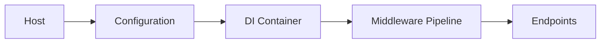
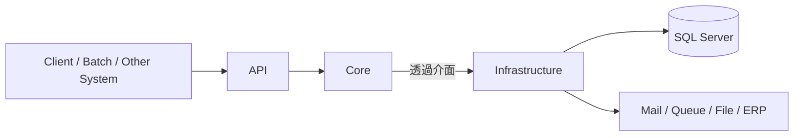
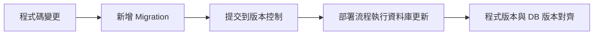
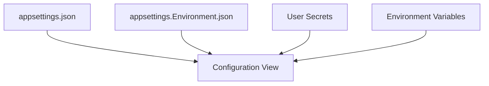
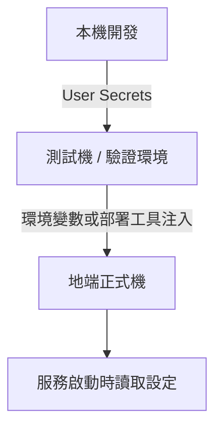
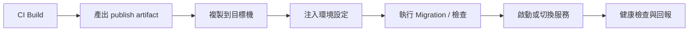

---
layout: cover
background: https://images.unsplash.com/photo-1516321318423-f06f85e504b3?auto=format&fit=crop&w=1600&q=80
class: text-white
---

<div
  class="eyebrow"
  v-motion
  :initial="{ opacity: 0, y: -40 }"
  :enter="{ opacity: 1, y: 0, transition: { duration: 700 } }"
>
  伺服器管控 · .NET 工程化 
</div>

<div
  v-motion
  :initial="{ opacity: 0, x: -80 }"
  :enter="{ opacity: 1, x: 0, transition: { duration: 900, delay: 120 } }"
>

# 用 .NET Core+ 建立可控的後端工程系統

</div>

<div
  class="hero-copy"
  v-motion
  :initial="{ opacity: 0, y: 24 }"
  :enter="{ opacity: 1, y: 0, transition: { duration: 800, delay: 260 } }"
>
  從 ASP.NET MVC / WebForms 的網站思維<br>
  切換到現代 ASP.NET Core 的後端工程思維
</div>

<div
  class="hero-meta"
  v-motion
  :initial="{ opacity: 0, y: 30 }"
  :enter="{ opacity: 1, y: 0, transition: { duration: 800, delay: 420 } }"
>
  企業內部 <span class="font-bold">API / Infrastructure / Core</span> 架構，地端自行部署
</div>

---
layout: two-cols-header
transition: slide-left
---

# 今天要回答的不是 API 細節，而是工程模型

::left::

<div
  class="panel panel--legacy"
  v-motion
  :initial="{ opacity: 0, x: -50 }"
  :enter="{ opacity: 1, x: 0 }"
>

<div class="col-badge col-badge--legacy">舊 ASP.NET 世界</div>

- `IIS` / `web.config` / `Global.asax` 是主舞台
- 網站專案常同時裝 UI、流程、資料存取、設定
- 關鍵流程常綁在人腦記憶與手動操作

</div>

::right::

<div
  class="panel panel--modern"
  v-motion
  :initial="{ opacity: 0, x: 50 }"
  :enter="{ opacity: 1, x: 0, transition: { delay: 160 } }"
>

<div class="col-badge col-badge--modern">現代 ASP.NET Core</div>

- Host、Middleware、DI、Configuration 可程式化
- API / Core / Infrastructure 可清楚分責
- 發佈、Migration、設定、部署都能進工程流程

</div>

---
layout: default
---

# 舊世界的主要痛點

<div class="panel small">

| 常見現象 | 真正的工程問題 |
| --- | --- |
| Controller 直接 new service / repository | 依賴隱藏，難測、難換 |
| SQL、商業規則、設定混在一起 | 修改牽一髮動全身 |
| DB 變更靠手動 SQL 或口頭通知 | 程式版與資料庫版脫鉤 |
| publish 後再改設定檔 | 環境不可重建，不可追蹤 |
| IIS 站台靠環境個別設定 | 部署知識綁在人，不綁在流程 |

</div>

<div class="mt-4 soft-grid three">
  <div class="panel metric-card" v-motion :initial="{ opacity: 0, y: 30 }" :enter="{ opacity: 1, y: 0 }"><div class="metric">高耦合</div><div class="small muted">改一處，處處連鎖</div></div>
  <div class="panel metric-card" v-motion :initial="{ opacity: 0, y: 30 }" :enter="{ opacity: 1, y: 0, transition: { delay: 120 } }"><div class="metric">低可測</div><div class="small muted">只能整站跑驗證</div></div>
  <div class="panel metric-card" v-motion :initial="{ opacity: 0, y: 30 }" :enter="{ opacity: 1, y: 0, transition: { delay: 240 } }"><div class="metric">低可控</div><div class="small muted">版本與環境不透明</div></div>
</div>

---
layout: statement
---

# 現代 .NET 想解的是工程控制點

<div
  class="statement-body"
  v-motion
  :initial="{ opacity: 0, scale: 0.92 }"
  :enter="{ opacity: 1, scale: 1, transition: { duration: 600 } }"
>
  把 <span class="accent">啟動、依賴、設定、資料庫版本、部署流程</span><br>
  變成可以被組裝、被測試、被追蹤的工程資產。
</div>

---
layout: section
transition: slide-up
---

# 序章

## 啟動架構

`Host` · `Middleware` · `DI` · `Configuration`

---
layout: two-cols-header
transition: slide-left
---

# 從網站思維轉成後端系統思維

::left::

<div class="panel" v-motion :initial="{ opacity: 0, x: -50 }" :enter="{ opacity: 1, x: 0 }">

### 舊 ASP.NET

- IIS 啟動網站
- `Global.asax` 接事件
- `web.config` 承擔大量設定
- 平台生命週期常像黑盒

</div>

::right::

<div class="panel" v-motion :initial="{ opacity: 0, x: 50 }" :enter="{ opacity: 1, x: 0, transition: { delay: 160 } }">

### ASP.NET Core

- `Program.cs` 明確建立 Host
- Configuration 分層載入設定
- DI 與 Middleware 在啟動時組裝
- 啟動流程是程式碼，不是背景魔法

</div>

---
layout: two-cols
---

# .NET Core 不是框架

::left::

<div class="platform-stack">

<div class="platform-layer platform-layer--tooling" v-click>
  <div class="layer-num">④</div>
  <div>
    <div class="layer-name">工具鏈 Tooling</div>
    <div class="layer-detail">dotnet CLI · NuGet · Build System</div>
  </div>
</div>

<div class="platform-layer platform-layer--framework" v-click>
  <div class="layer-num">③</div>
  <div>
    <div class="layer-name">Framework</div>
    <div class="layer-detail">ASP.NET Core · Worker Service · gRPC · Blazor</div>
  </div>
</div>

<div class="platform-layer platform-layer--bcl" v-click>
  <div class="layer-num">②</div>
  <div>
    <div class="layer-name">標準函式庫 BCL</div>
    <div class="layer-detail">IO · HTTP · JSON · Threading</div>
  </div>
</div>

<div class="platform-layer platform-layer--runtime" v-click>
  <div class="layer-num">①</div>
  <div>
    <div class="layer-name">Runtime — CLR</div>
    <div class="layer-detail">執行 C# · GC 記憶體管理 · JIT 編譯</div>
  </div>
</div>

</div>

::right::

<div class="panel small ml-2" v-click>

## 簡單來說

1. .NET 是`Platform`，不是單一框架
2. `ASP.NET Core` 只是其中**一種用途**
3. `Runtime` 只是最底層的**一層**

</div>

<div class="panel small mt-3  ml-2" v-click>

## vs .NET Framework

<div class="compare-row"><span class="muted">Host</span><span>IIS 唯一 → <span class="accent-green">可自行 Host</span></span></div>
<div class="compare-row"><span class="muted">平台</span><span>Windows 限定 → <span class="accent-green">跨平台</span></span></div>
<div class="compare-row"><span class="muted">架構</span><span>單一框架 → <span class="accent-green">模組化平台</span></span></div>

</div>

---
layout: default
---

# Host / Middleware / DI / Configuration 各自做什麼



<div class="mt-5 soft-grid four">

<div class="panel small" v-click>
<div class="layer-name mb-1">Host</div>
決定怎麼啟動、停止<br>掛 <code>logging</code>、執行環境
</div>

<div class="panel small" v-click>
<div class="layer-name mb-1">Configuration</div>
整合 JSON 檔案、<code>User Secrets</code><br>環境變數、命令列參數
</div>

<div class="panel small" v-click>
<div class="layer-name mb-1">DI Container</div>
宣告依賴關係<br>避免物件自行到處找東西
</div>

<div class="panel small" v-click>
<div class="layer-name mb-1">Middleware</div>
把 HTTP 流程拆成<br>可插拔的獨立段落
</div>

</div>

---
layout: two-cols-header
clicks: 3
---

# 最小範例：啟動流程長什麼樣

::left::

````md magic-move {at:2, lines: true}
```cs
var builder = WebApplication.CreateBuilder(args);

builder.Services.AddControllers();

var app = builder.Build();
app.MapControllers();
app.Run();
```
```cs
var builder = WebApplication.CreateBuilder(args);

builder.Services.AddControllers();
builder.Services.AddEndpointsApiExplorer();
builder.Services.AddSwaggerGen();

var app = builder.Build();
app.UseHttpsRedirection();
app.MapControllers();
app.Run();
```
<<< @/snippets/program.cs cs {*}{maxHeight:'400px'}
````

::right::

<div class="panel small" v-motion :initial="{ opacity: 0, x: 40 }" :enter="{ opacity: 1, x: 0 }">

<v-clicks>

- 第一段先看到最小可運作的 HTTP 入口
- 第二段補進 API 專案常見的開發配備
- 最後一步才把完整組裝與 middleware 串完整

</v-clicks>

</div>

---
layout: section
transition: slide-up
---

# 第二章

## 三層架構：API / Core / Infrastructure

責任分離 · 用例隔離 · 依賴反轉

---
layout: default
---

# API / Infrastructure / Core：三個常見的分層目的?



<div class="mt-4 soft-grid three">

<div class="panel small" v-click>
<div class="layer-name mb-1">API 層</div>
HTTP 入口、DTO、授權、Route 組裝<br>
<span class="muted">不碰商業邏輯，不直接存取資料庫</span>
</div>

<div class="panel small" v-click>
<div class="layer-name mb-1">Core 層</div>
用例、商業規則、流程、抽象介面定義<br>
<span class="muted">不依賴任何 Infrastructure 實作</span>
</div>

<div class="panel small" v-click>
<div class="layer-name mb-1">Infrastructure 層</div>
EF Core、外部服務、資料庫、設定實作<br>
<span class="muted">透過介面被 Core 呼叫，隨時可替換</span>
</div>

</div>

---
layout: two-cols-header
transition: slide-left
---

# 舊 vs 新：功能到底寫在哪裡

::left::

<div class="panel small" v-motion :initial="{ opacity: 0, x: -40 }" :enter="{ opacity: 1, x: 0 }">

### 舊做法

- Controller 直接寫流程
- Controller 直接碰 EF / SQL
- 寄信、檔案、設定都在同一層呼叫
- 需求一變，整條 HTTP 端一起改

</div>

::right::

<div class="panel small" v-motion :initial="{ opacity: 0, x: 40 }" :enter="{ opacity: 1, x: 0, transition: { delay: 160 } }">

### 新模型

- API 接住 HTTP 世界
- Core 定義用例與規則
- Infrastructure 提供技術細節
- 變的是實作，不是整個系統骨架

</div>

---
layout: two-cols
clicks: 3
---

# 最小範例：DI 與用例註冊

::left::

````md magic-move {at:1, lines: true}
```cs {style="font-size:0.84em"}
builder.Services.AddScoped<
    IOrderApprovalService,
    OrderApprovalService>();

builder.Services.AddScoped<IClock, SystemClock>();
```
```cs {style="font-size:0.84em"}
builder.Services.AddScoped<
    IOrderApprovalService,
    OrderApprovalService>();
builder.Services.AddScoped<IClock, SystemClock>();

builder.Services.AddDbContext<AppDbContext>(opt =>
    opt.UseSqlServer(
        config.GetConnectionString("MainDb")));
```
<<< @/snippets/dependency-registration.cs cs {*}{maxHeight:'360px',style:"font-size:0.84em"}
````

::right::

<div class="panel small">

<v-clicks>

- 先只看到 Core 的抽象能力註冊
- 再補進 Infrastructure 的資料存取實作
- 最後得到完整、可替換、可測試的組裝版本

</v-clicks>

</div>

---
layout: section
transition: slide-up
---

# 第三章

## 資料庫版本治理

EF Core · Migration · DbContext

---
layout: default
transition: slide-left
---

# ORM / EF Core 先解的是哪些舊痛點

<div class="soft-grid two">

<div class="panel small panel--legacy">
<div class="col-badge col-badge--legacy">傳統 ADO.NET / SQL</div>

- mapping 樣板碼很多
- connection / transaction 管理零散
- 查詢散在各層，重用差
- schema 改了，程式不一定同步
</div>

<div class="panel small panel--modern">
<div class="col-badge col-badge--modern">EF Core 的改善</div>

- `DbContext` 集中資料存取
- query 與模型可以工程化治理
- migration 可描述 schema 版本
- 交易、攔截器、追蹤策略比較可控
</div>

</div>

---
layout: default
---

# Migration 不是建表工具，而是版本治理工具



<div class="mt-4 soft-grid four">

<div class="panel small" v-click>
<div class="layer-name mb-1">可追蹤</div>
DB 變更有歷史，知道誰改了什麼
</div>

<div class="panel small" v-click>
<div class="layer-name mb-1">可重建</div>
新環境直接執行 migration，不靠手工腳本
</div>

<div class="panel small" v-click>
<div class="layer-name mb-1">可比對</div>
程式版本與 DB schema 版本對齊，差異一目了然
</div>

<div class="panel small" v-click>
<div class="layer-name mb-1">可驗證</div>
部署流程能確認程式對應正確的 schema 版本
</div>

</div>

---
layout: two-cols
clicks: 3
---

# 最小範例：DbContext 與 Migration 指令

::left::

````md magic-move {at:1, lines: true}
```cs
public sealed class AppDbContext : DbContext
{
    public DbSet<Order> Orders => Set<Order>();
}
```
```cs
public sealed class AppDbContext : DbContext
{
    public AppDbContext(DbContextOptions<AppDbContext> options) : base(options)
    {
    }

    public DbSet<Order> Orders => Set<Order>();
}
```
<<< @/snippets/db-context.cs cs {*}{maxHeight:'360px'}
````

::right::

````md magic-move {at:2, lines: true}
```powershell
dotnet ef migrations add InitOrderModule
```
```powershell
dotnet ef migrations add InitOrderModule `
  --project src/Company.Project.Infrastructure `
  --startup-project src/Company.Project.Api
```
<<< @/snippets/migration-commands.ps1 powershell {*}{maxHeight:'360px'}
````

---
layout: section
transition: slide-up
---

# 第四章

## 設定治理

Configuration · Secrets · Environment Variables

---
layout: two-cols-header
---

# 設定治理：設定不是值而已，是系統邊界

::left::



::right::

<div class="panel small">

### 設定來源的基本順序

1. `appsettings.json`
2. `appsettings.{Environment}.json`
3. User Secrets（開發機）
4. Environment Variables
5. 命令列參數

</div>

---
layout: two-cols
clicks: 3
---

# 最小範例：`appsettings` 怎麼長大

::left::

````md magic-move {at:1, lines: true}
```json
{
  "ConnectionStrings": {
    "MainDb": "Server=.;Database=OrdersDb;Trusted_Connection=True"
  }
}
```
```json
{
  "ConnectionStrings": {
    "MainDb": "Server=.;Database=OrdersDb;Trusted_Connection=True"
  },
  "Mail": {
    "Host": "smtp.internal.local"
  }
}
```
<<< @/snippets/appsettings.json json {*}{maxHeight:'380px'}
````

::right::

<div class="panel small">

<v-clicks>

- 第一步先放非敏感的基礎設定
- 第二步擴充模組化的運行參數
- 最後維持可讀性，同時把敏感值留給外部覆寫

</v-clicks>

</div>

---
layout: two-cols
transition: slide-left
---

# 哪些值該放檔案，哪些不該

::left::

<div class="panel small" v-motion :initial="{ opacity: 0, y: 30 }" :enter="{ opacity: 1, y: 0 }">

### 可以進 repo

- 非敏感預設值
- Feature flags 預設狀態
- Logging level
- Timeout、批次大小等運行參數

</div>

::right::

<div class="panel small" v-motion :initial="{ opacity: 0, y: 30 }" :enter="{ opacity: 1, y: 0, transition: { delay: 160 } }">

### 不該直接進 repo

- 密碼、token、連線字串祕密段
- 憑證與私鑰
- 第三方 API secrets
- 長期固定的高權限共用帳密

</div>

---
layout: two-cols-header
clicks: 3
---

# 最小範例：環境變數如何覆寫設定

::left::

````md magic-move {at:1, lines: true}
```powershell
$env:ASPNETCORE_ENVIRONMENT = "Production"
```
```powershell
$env:ASPNETCORE_ENVIRONMENT = "Production"
$env:ConnectionStrings__MainDb = `
  "Server=sql-prod;Database=OrdersDb;User Id=svc_api;Password=***"
```
<<< @/snippets/environment-override.ps1 powershell {*}{maxHeight:'360px'}
````

::right::

<div class="panel small">

<v-clicks>

- 階層式 key 用 `__` 雙底線分隔
- 同一套程式可在不同機器注入不同值
- publish 包不需要內建正式環境祕密

</v-clicks>

</div>

---
layout: two-cols
---

# 從開發到地端部署：設定鏈路要打通

::left::



::right::

<div class="panel small">

<v-clicks>

- 本機：每位開發者保有自己的敏感設定
- 部署：由機器、服務或流程注入
- 保護：最小暴露、分環境隔離、可輪替

</v-clicks>

</div>

---
layout: statement
---

# 真正危險的不是「有沒有用環境變數」

<div
  class="statement-body danger-body"
  v-motion
  :initial="{ opacity: 0, scale: 0.9 }"
  :enter="{ opacity: 1, scale: 1, transition: { duration: 600 } }"
>
  而是裡面裝了什麼、誰能看、誰能改、怎麼輪替。<br>
  現代化不是把密碼從檔案搬家，而是建立治理方式。
</div>

---
layout: section
transition: slide-up
---

# 第五章

## 地端自部署

標準化流程 · 產物解耦 · 可重複執行

---
layout: two-cols-header
transition: slide-left
---

# 地端自部署也可以很現代

::left::

<div class="panel small">

### 手動 IIS 點選式部署

- 站台設定散落在視窗
- 同一專案在不同機器做法不同
- 發生故障難以比對差異
- 人工步驟越多，錯誤率越高

</div>

::right::

<div class="panel small">

### 標準化部署模型

- 產物固定，與環境解耦
- 設定外部化，不藏在 artifact
- DB 更新是顯性步驟
- 啟動參數明確
- 可重複、可追蹤、可交接

</div>

---
layout: two-cols
---

# 地端自部署的基本流程

::left::



::right::

<div class="panel small">

<v-clicks>

- 一開始可以只是 PowerShell + 目錄慣例
- 關鍵不是工具名稱，而是流程標準化
- 地端部署也應該把設定、版本、啟動方式文件化

</v-clicks>

</div>

---
layout: two-cols-header
clicks: 3
---

# 最小範例：部署腳本與外部化設定

::left::

````md magic-move {at:1, lines: true}
```powershell
param(
    [string]$ArtifactPath = "D:\deploy\orders-api"
)
```
```powershell
param(
    [string]$ArtifactPath = "D:\deploy\orders-api",
    [string]$ServiceName = "OrdersApi"
)

$env:ASPNETCORE_ENVIRONMENT = "Production"
```
<<< @/snippets/deploy.ps1 powershell {*}{maxHeight:'365px'}
````

::right::

<div class="panel small">

<v-clicks>

- artifact 應與環境解耦，才能跨機器複用
- 部署時才決定正式環境連線與祕密
- DB 更新要在流程中明確出現，不能隱藏

</v-clicks>

</div>

---
layout: two-cols
---

# 新專案一開始就該建立的工程基線

::left::

<div class="panel small">

### 專案骨架

- API / Core / Infrastructure 分層
- `Program.cs` 統一組裝
- Options / Configuration 綁定規則
- 統一 logging、例外處理、health checks

</div>

::right::

<div class="panel small">

### 工程流程

- Migration 進版控
- 本機敏感值不進 repo
- 發佈產物與環境設定分離
- 至少有 build、test、deploy 基本腳本
- 文件寫清楚啟動與部署方式

</div>

---
layout: two-cols
---

# 今天要帶走的核心訊息

::left::

<div class="panel">

1. 現代 .NET 的價值在**工程控制點**
2. API / Core / Infrastructure 是**責任分離**
3. EF Core + Migration 是**資料庫版本治理**
4. 設定與祕密治理是**系統邊界的一部分**
5. 地端自部署一樣可以**流程化、可控化**

</div>

::right::

<div class="panel">

### 下一步建議

- 下個新專案直接用三層骨架開始
- 先補齊設定與祕密管理規範
- 把 Migration 納入日常開發流程
- 用腳本取代手動部署，沉澱流程知識

</div>

---
layout: end
---

<div
  v-motion
  :initial="{ opacity: 0, scale: 0.9 }"
  :enter="{ opacity: 1, scale: 1, transition: { duration: 800 } }"
>

# Q & A

</div>

<div
  class="hero-copy"
  v-motion
  :initial="{ opacity: 0, y: 30 }"
  :enter="{ opacity: 1, y: 0, transition: { delay: 200 } }"
>
  從「網站能跑」走到「系統可控」<br>
  就是現代後端工程的起點
</div>

<div
  class="hero-meta"
  v-motion
  :initial="{ opacity: 0, y: 20 }"
  :enter="{ opacity: 1, y: 0, transition: { delay: 380 } }"
>
  slides.md · Slidev · <span class="accent">ASP.NET Core</span>
</div>
