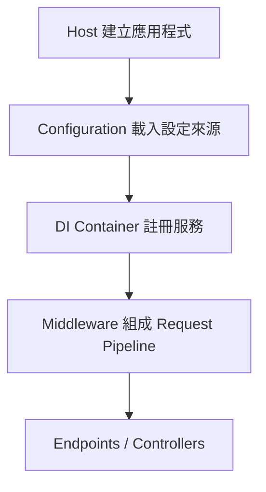
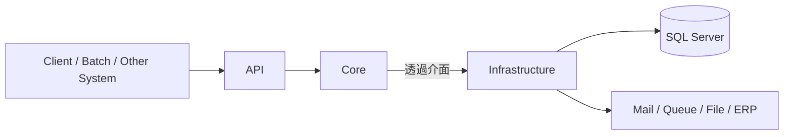
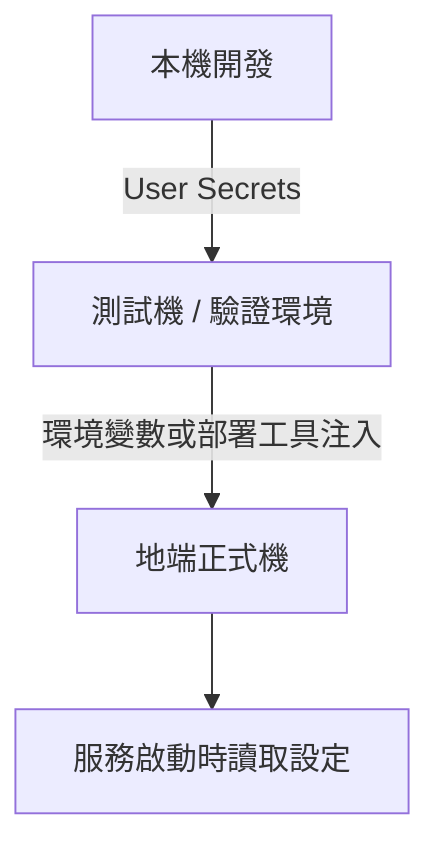
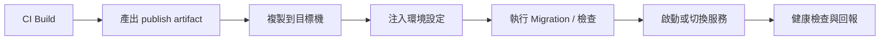

---
layout: cover
background: https://images.unsplash.com/photo-1516321318423-f06f85e504b3?auto=format&fit=crop&w=1600&q=80
class: text-white
---

Slidev 教育訓練

# 用現代 .NET 建立可控的後端工程系統

從 ASP.NET MVC / WebForms 的網站思維  
切換到現代 ASP.NET Core 的後端工程思維

主案例：企業內部 API / Infrastructure / Core 架構，地端自行部署

---
layout: two-cols-header
---

# 今天要回答的不是 API 細節，而是工程模型

::left::

### 舊 ASP.NET 世界

- IIS / `web.config` / Global.asax 是主舞台
- 網站專案常同時裝 UI、流程、資料存取、設定
- 很多關鍵流程靠人工點選與機器記憶

::right::

### 現代 ASP.NET Core 世界

- Host、Middleware、DI、Configuration 可程式化
- API / Core / Infrastructure 讓責任分層
- 發佈、Migration、設定、部署可以納入工程流程

---
layout: two-cols
---

# 舊世界的主要痛點

| 常見現象 | 真正的工程問題 |
| --- | --- |
| Controller 直接 new service / repository | 依賴隱藏，難測、難換 |
| SQL、商業規則、設定混在一起 | 修改牽一髮動全身 |
| DB 變更靠手動 SQL 或口頭通知 | 程式版與資料庫版脫鉤 |
| publish 後再改設定檔 | 環境不可重建，不可追蹤 |
| IIS 站台靠手動點選設定 | 部署知識綁在人，不綁在流程 |

  

高耦合

一改就連鎖反應

  

低可測

只能整站驗證

  

低可控

環境與版本狀態不透明

---
layout: statement
---

# 現代 .NET 先解掉的是工程控制點

把 啟動、依賴、設定、資料庫版本、部署流程  
都變成可以組裝、測試、追蹤的工程資產。

---
layout: two-cols-header
---

# 從網站思維轉成後端系統思維

::left::

### 舊 ASP.NET

- IIS 啟動網站
- `Global.asax` 接事件
- `web.config` 承擔大量設定
- 平台生命週期常像黑盒

::right::

### ASP.NET Core

- `Program.cs` 明確建立 Host
- Configuration 分層載入設定
- DI 與 Middleware 在啟動時組裝
- 啟動流程是程式碼，不是背景魔法

---
layout: two-cols
---

# Host / Middleware / DI / Configuration 各自做什麼

::left::

::right::

- **Host**：決定怎麼啟動、停止、掛 logging
- **Configuration**：整合檔案、祕密、環境變數
- **DI**：宣告依賴關係，避免自行到處找東西
- **Middleware**：把 HTTP 流程拆成可插拔的段落

---
layout: two-cols-header
---

# 最小範例：啟動流程長什麼樣

::left::

<<< @/snippets/program.cs {cs}{maxHeight:'400px'}

::right::

<v-clicks>

- 新同事讀 `Program.cs` 就能理解系統怎麼組起來
- 驗證、授權、例外處理不再散在各角落
- 啟動流程越透明，維護與交接成本越低

</v-clicks>

---
layout: two-cols
---

# API / Infrastructure / Core：三層不是為了漂亮

::left::

::right::

- **API**：HTTP 入口、DTO、授權、組裝
- **Core**：用例、商業規則、流程、抽象介面
- **Infrastructure**：EF Core、外部服務、資料庫、設定實作

---
layout: two-cols-header
---

# 舊 vs 新：功能到底寫在哪裡

::left::

### 舊做法

- Controller 直接寫流程
- Controller 直接碰 EF / SQL
- 寄信、檔案、設定都在同一層呼叫
- 需求一變，整條 HTTP 端一起改

::right::

### 新模型

- API 接住 HTTP 世界
- Core 定義用例與規則
- Infrastructure 提供技術細節
- 變的是實作，不是整個系統骨架

---
layout: two-cols
---

# 最小範例：DI 與用例註冊

::left::

<<< @/snippets/dependency-registration.cs {cs}{maxHeight:'390px'}

::right::

### 為什麼這樣切比較能維護

- API 只依賴 Core 的能力
- Infrastructure 在啟動時被接上去
- 單元測試可以替換掉實作
- 改 DB 或外部服務，不必重寫 use case

---
layout: two-cols
---

# ORM / EF Core 先解的是哪些舊痛點

::left::

### 傳統手寫 ADO.NET / SQL

- mapping 樣板碼很多
- connection / transaction 管理零散
- 查詢散在各層，重用差
- schema 改了，程式不一定同步

::right::

### EF Core 的改善

- `DbContext` 集中資料存取
- query 與模型可以工程化治理
- migration 可描述 schema 版本
- 交易、攔截器、追蹤策略比較可控

---
layout: two-cols-header
---

# Migration 不是建表工具，而是版本治理工具

::left::

::right::

- DB 變更有歷史可追
- 新環境可重建
- 環境差異比較容易被發現
- 部署流程能驗證程式對應的 schema

---
layout: two-cols
---

# 最小範例：DbContext 與 Migration 指令

::left::

<<< @/snippets/db-context.cs {cs}{maxHeight:'360px'}

::right::

<<< @/snippets/migration-commands.ps1 {powershell}{maxHeight:'360px'}

---
layout: two-cols-header
---

# 設定治理：設定不是值而已，是系統邊界

::left::

<<< @/snippets/appsettings.json {json}{maxHeight:'380px'}

::right::

### 設定來源的基本順序

1. `appsettings.json`
2. `appsettings.{Environment}.json`
3. User Secrets（開發機）
4. Environment Variables
5. 命令列參數

---
layout: two-cols
---

# 哪些值該放檔案，哪些不該

::left::

### 可以進 repo

- 非敏感預設值
- Feature flags 預設狀態
- Logging level
- Timeout、批次大小等運行參數

::right::

### 不該直接進 repo

- 密碼、token、連線字串祕密段
- 憑證與私鑰
- 第三方 API secrets
- 長期固定的高權限共用帳密

---
layout: two-cols-header
---

# 最小範例：環境變數如何覆寫設定

::left::

<<< @/snippets/environment-override.ps1 {powershell}{maxHeight:'360px'}

::right::

### 核心原則

- 階層式 key 用 `__`
- 同一套程式可在不同機器注入不同值
- publish 包不需要內建正式環境祕密
- 環境切換靠外部注入，不靠改程式碼

---
layout: two-cols
---

# 從開發到地端部署：設定鏈路要打通

::left::

::right::

### 使用、儲存、保護要一起談

- 本機：每位開發者保有自己的敏感設定
- 部署：由機器、服務或流程注入
- 保護：最小暴露、分環境隔離、權限限制、可輪替

---
layout: statement
---

# 真正危險的不是「有沒有用環境變數」

而是 裡面裝了什麼、誰能看、誰能改、怎麼輪替。  
現代化不是把密碼從檔案搬家，而是建立治理方式。

---
layout: two-cols-header
---

# 地端自部署也可以很現代

::left::

### 手動 IIS 點選式部署

- 站台設定散落在視窗
- 同一專案在不同機器做法不同
- 發生故障難以比對差異
- 人工步驟越多，錯誤率越高

::right::

### 標準化部署模型

- 產物固定
- 設定外部化
- DB 更新是顯性步驟
- 啟動參數明確
- 可重複、可追蹤、可交接

---
layout: two-cols
---

# 地端自部署的基本流程

::left::

::right::

- 一開始可以只是 PowerShell + 目錄慣例
- 關鍵不是工具名稱，而是流程標準化
- 地端部署也應該把設定、版本、啟動方式文件化

---
layout: two-cols-header
---

# 最小範例：部署腳本與外部化設定

::left::

<<< @/snippets/deploy.ps1 {powershell}{maxHeight:'365px'}

::right::

- artifact 應與環境解耦
- 部署時才決定正式環境連線與祕密
- DB 更新要在流程中明確出現
- 啟動與回滾至少要有明確操作邊界

---
layout: two-cols
---

# 新專案一開始就該建立的工程基線

::left::

### 專案骨架

- API / Core / Infrastructure 分層
- `Program.cs` 統一組裝
- Options / Configuration 綁定規則
- 統一 logging、例外處理、health checks

::right::

### 工程流程

- Migration 進版控
- 本機敏感值不進 repo
- 發佈產物與環境設定分離
- 至少有 build、test、deploy 基本腳本
- 文件寫清楚啟動與部署方式

---
layout: two-cols
---

# 今天要帶走的核心訊息

::left::

1. 現代 .NET 的價值在工程控制點  
2. API / Core / Infrastructure 是責任分離  
3. EF Core + Migration 是資料庫版本治理  
4. 設定與祕密治理是系統邊界的一部分  
5. 地端自部署一樣可以流程化、可控化

::right::

### 下一步建議

- 下個新專案直接用三層骨架
- 先補齊設定與祕密管理規範
- 把 Migration 納入日常流程
- 用腳本取代手動部署知識

---
layout: end
---

# Q&A

從「網站能跑」走到「系統可控」  
就是現代後端工程的起點
